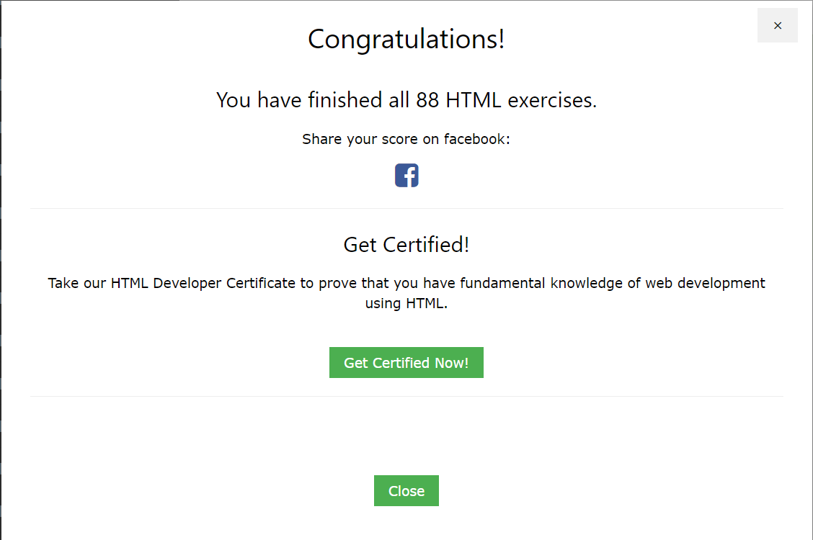

# ClassTime - Trabajo Inicial Modulo-1

<h2>Modulos 1 y 2</h2>

Realizar una página html con la siguiente información:

<ol>
    <li>
      
Resultado de ejecutar los ejercicios HTML de: <a href="https://www.w3schools.com/html/html_exercises.asp" target="_blank">https://www.w3schools.com/html/html_exercises.asp</a>

     </li>
     <li>
      
Resultado de ejecutar los ejercicios CSS de: <a href="https://www.w3schools.com/css/exercise.asp" target="_blank">https://www.w3schools.com/css/exercise.asp</a>

     </li>
     <li>
      
El resultado subirlo al repositorio GitHub

     </li>
</ol>
<table >
  <tr>
    <td>
      
    </td>
    <td>
      
    </td>
  </tr>
</table>
